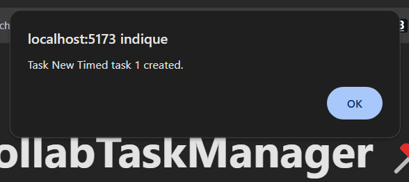

Projet créé dans le cadre du cours de Design Patterns M1 Lead Développeur Full Stack IIM 

# Installation

```sh
cd CollabTaskManager
npm install
npm run dev
```

## Screenshots
Créer une tache :


Marquer une tache comme terminée :


Notifications : 




Tri par taches non terminées/terminées : 


## Credits

Créé par Enzo AIT-YAKOUB (enzo.ait-yakoub@edu.devinci.fr)